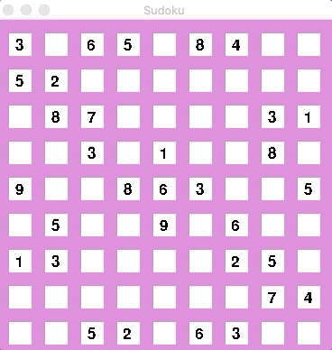

# Sudoku-Solver
Interactive Sudoku solver with GUI
- Backtracking algorithm to solve Sudoku puzzle
- Utilized Pygame and PyQt for GUI
- Inspired by https://www.youtube.com/watch?v=jl5yUEdekEM&t=329s

# Directions
- Click on the box that you would like to enter a number into and press the corresponding number key
- If the correct selection was made, the box will become green. If an incorrect selection was made, the box will become red. 
- Double tap the space bar to have the Sudoku puzzle completed

# Demo

